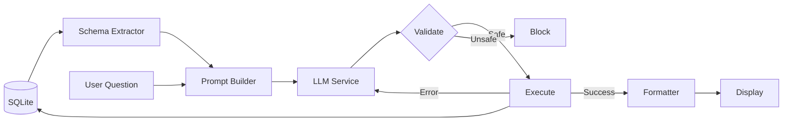
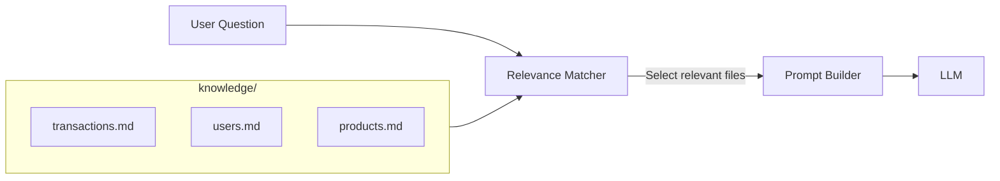
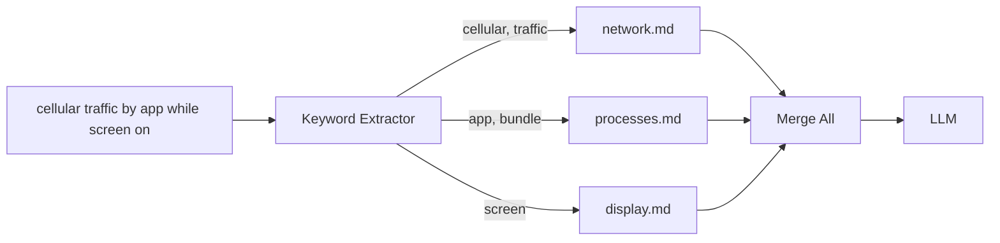

# Natural Language SQLite Query Tool - Design RFC

> **Status:** Awaiting Approval
> **Trigger:** User request for natural language database query tool

---

## 1. EXECUTIVE SUMMARY & CONSTRAINTS

### A. Context & Assumptions

| Item | Description |
|------|-------------|
| **Goal** | Convert natural language questions to SQLite queries |
| **Inputs** | SQLite database file + user question string |
| **Environment** | Python 3.10+, requires LLM API access (OpenAI/Anthropic/Ollama) |
| **Unknowns** | Database schema complexity varies; LLM accuracy depends on schema clarity |

### B. Requirements Analysis (V-Model Level 1)

**User Story:**
> "As a data analyst, I want to ask questions in plain English and get results from my SQLite database without knowing SQL or the schema structure."

**Acceptance Criteria (Definition of Done):**
1. [ ] System extracts schema from any SQLite database file
2. [ ] System generates valid SQLite SQL from natural language question
3. [ ] System executes query safely (READ-ONLY by default)
4. [ ] System displays results in formatted table
5. [ ] System handles query errors with automatic retry/correction

---

## 2. PROPOSED SOLUTION

### A. Algorithm & Logic

```
Step 1: Load SQLite database and extract schema
        → Tables, columns, types, foreign keys
        
Step 2: Build context prompt with schema + user question
        → Follow prompt_engineering.md template
        
Step 3: Call LLM to generate SQL
        → Temperature 0.0 for deterministic output
        
Step 4: Validate SQL is SELECT-only (safety check)
        
Step 5: Execute query with timeout protection
        
Step 6: If error → feed error to LLM → retry (max 3x)
        
Step 7: Format and display results
```

**Complexity:** O(1) for schema extraction, O(n) for result display where n = row count

### B. Data Flow



### C. Technology Stack

Per [tech-stack.md](file:///home/etem/sqlite-query-engine/.agent/rules/tech-stack.md):

| Component | Library | Rationale |
|-----------|---------|-----------|
| Database | `sqlite3` (stdlib) | Zero dependencies |
| Validation | `pydantic` | Required by tech-stack |
| LLM | `anthropic` (default) / `openai` / `ollama` | Native SDKs only |
| Display | `rich` | Beautiful tables |
| Config | `pyyaml` | Human-readable |
| Testing | `pytest` + `pytest-mock` | Standard |

> [!NOTE]
> **No LangChain/LlamaIndex** - Prohibited per tech-stack rules. All LLM logic is explicit Python.

---

## 2.5 DOMAIN KNOWLEDGE LAYER

> **Key Insight:** LLMs cannot understand domain-specific semantics without human guidance.

### A. Design Principles

| Principle | Solution |
|-----------|----------|
| **Natural Language** | Write guidance in plain English/Markdown, not YAML |
| **Scalable Structure** | One file per domain/table group, not one monolithic file |
| **Minimal Effort** | Only document what's confusing; skip obvious columns |

### B. Knowledge Directory Structure

```
knowledge/
├── README.md              # Overview of the database
├── transactions.md        # Everything about transaction tables
├── users.md               # User/account related tables
├── products.md            # Product catalog tables
└── _examples.md           # Common query patterns (optional)
```

### C. Natural Language Format (Markdown)

**Example: `knowledge/transactions.md`**

```markdown
# Transactions Domain

## Tables
- `transactions` - All financial transactions
- `transaction_types` - Lookup table for transaction codes

## Key Concepts

### Transaction Codes
The `txn_cd` column uses these codes:
- D = Debit (money going out)
- C = Credit (money coming in)
- T = Transfer (internal movement)

### Amounts
All amounts in `amt` column are stored in **cents**. 
Divide by 100 to get dollars.

### Status Values
- S = Success (completed)
- P = Pending
- F = Failed
- R = Refunded

## Business Rules
- "Revenue" means sum of Credit transactions (txn_cd = 'C')
- "Completed" transactions have status = 'S'
- Ignore transactions with status = 'F' unless asked

## Common Queries

Q: What's our monthly revenue?
A: SELECT SUM(amt)/100 FROM transactions WHERE txn_cd='C' AND strftime('%Y-%m', date) = '2024-01'

Q: Show failed transactions
A: SELECT * FROM transactions WHERE status = 'F'
```

### D. How It Works



**Smart Loading:**
- System analyzes user question keywords
- Loads only relevant knowledge files (not all 100+)
- Injects into prompt as context

### E. Workflow

```bash
# 1. Initialize knowledge folder (one-time)
python main.py --db mydata.db --init-knowledge
# Creates knowledge/ folder with README.md template

# 2. Add knowledge gradually (as needed)
# Just create markdown files when LLM gets confused

# 3. Interactive learning
python main.py --db mydata.db --learn
> What's our revenue?
🤖 Generated SQL: SELECT SUM(amount)... (wrong!)
❌ Correct SQL: SELECT SUM(amt)/100 FROM transactions WHERE txn_cd='C'
💡 Which knowledge file should I update? [transactions.md]
✅ Added to knowledge/transactions.md
```

### F. Minimal Effort Approach

> You don't need to document everything upfront!

| Start With | Add Later |
|------------|-----------|
| Tables with cryptic column names | Tables LLM keeps getting wrong |
| Non-obvious business rules | Edge cases discovered during use |
| Common query patterns | User-corrected examples |

### G. Multi-Hop Queries (Chain Resolution)

> **Real-World Challenge:** 
> "Cellular traffic by app while screen is on" requires:
> 1. `network.md` - traffic by PID
> 2. `processes.md` - PID to bundle name
> 3. `display.md` - screen state
> 
> That's a **3-hop join** across 3 knowledge files!

**Solution: Two-Layer Approach**

#### Layer 1: Comprehensive Keyword Matching


#### Layer 2: Join Recipes (`_joins.md`)

For complex multi-table scenarios, provide explicit "join recipes":

```markdown
# _joins.md - How to combine data across domains

## App Network Traffic (per bundle)
Tables: network_traffic → process_mapping → (app name)
Join chain:
1. network_traffic.pid → process_mapping.pid
2. process_mapping.bundle_name = 'com.example.app'

SQL Pattern:
SELECT SUM(n.bytes_tx + n.bytes_rx) as total_bytes, p.bundle_name
FROM network_traffic n
JOIN process_mapping p ON n.pid = p.pid
WHERE p.bundle_name = ?
GROUP BY p.bundle_name

---

## App Traffic While Screen On
Combines: network.md + processes.md + display.md
Join chain:
1. network_traffic.pid → process_mapping.pid (get app name)
2. network_traffic.timestamp → screen_events time range (filter screen on)

SQL Pattern:
SELECT p.bundle_name, SUM(n.bytes_tx + n.bytes_rx) as bytes
FROM network_traffic n
JOIN process_mapping p ON n.pid = p.pid
WHERE n.network_type = 'cellular'
  AND EXISTS (
    SELECT 1 FROM screen_events s
    WHERE s.screen_state = 1
    AND n.timestamp BETWEEN s.start_time AND s.end_time
  )
GROUP BY p.bundle_name
ORDER BY bytes DESC
```

**Knowledge file hints (optional but helpful):**

```markdown
# network.md

## Join Keys
- `pid` → joins to `process_mapping.pid`
- `timestamp` → can filter by `screen_events` time ranges
```

```markdown
# processes.md

## Join Keys
- `pid` → joins from `network_traffic.pid`
- `bundle_name` → human-readable app identifier
```

#### Why This Works

| Complexity | How It's Handled |
|------------|------------------|
| 2-hop (A→B) | Keyword matching loads both files |
| 3-hop (A→B→C) | Keyword matching + `_joins.md` recipes |
| Complex logic | Explicit SQL patterns in `_joins.md` |

### H. Auto-Discovery (LLM Generates Join Knowledge)

> **Yes!** The LLM can figure out most joins automatically. Human input is only needed for non-obvious cases.

#### What LLM Can Auto-Discover

| Source | What It Learns |
|--------|----------------|
| **Foreign Keys** | `FOREIGN KEY (pid) REFERENCES process_mapping(pid)` → obvious join |
| **Column Name Patterns** | `user_id` in table A, `id` in `users` table → likely join |
| **Schema Analysis** | One-time LLM pass over entire schema to map relationships |

#### Schema Analysis Command (One-Time)

```bash
python main.py --db mydata.db --analyze-schema

🔍 Analyzing schema for relationships...

Auto-discovered joins:
  ✓ network_traffic.pid → process_mapping.pid (FK)
  ✓ process_mapping.user_id → users.id (naming pattern)
  ✓ screen_events shared timestamp range with network_traffic

Generated: knowledge/_auto_joins.md
Review and edit if needed.
```

#### Learning From Corrections

```bash
python main.py --db mydata.db --learn

> Show app traffic while screen on
🤖 Generated SQL: [wrong - missing pid join]
❌ Correct SQL: SELECT ... JOIN process_mapping p ON n.pid = p.pid ...

💡 Learn this join pattern? [Y/n] y
✅ Added to knowledge/_joins.md:
   "network_traffic.pid → process_mapping.pid for app-level queries"
```

#### Summary: When Human Input Is Needed

| Scenario | Auto-Discovery Works? |
|----------|----------------------|
| Explicit foreign keys | ✅ Yes |
| Column name patterns (`user_id` → `users.id`) | ✅ Yes |
| Time-range correlations | ⚠️ Partial (needs hint) |
| Domain-specific business logic | ❌ No - needs human |
| Cryptic column meanings (`txn_cd = 'C'`) | ❌ No - needs human |

> **Bottom line:** Start with `--analyze-schema` for auto-discovery, then add human knowledge only where LLM fails.

---

## 3. VERIFICATION PLAN (V-Model Symmetry)

### Level 1: Acceptance Tests ↔ Requirements

| Requirement | Test |
|-------------|------|
| Extract schema | Load `test.db`, verify table/column extraction |
| Generate SQL | Ask "List all users", verify valid SELECT generated |
| Execute safely | Verify INSERT/DELETE blocked by default |
| Display results | Verify `rich` table renders correctly |
| Error recovery | Force SQL error, verify retry succeeds |

### Level 2: Integration Tests ↔ Architecture

| Interface | Test |
|-----------|------|
| Schema → Prompt | Extracted schema correctly injected into prompt |
| LLM → Executor | Generated SQL passes to executor without corruption |
| Executor → Formatter | Query results correctly formatted |

### Level 3: Unit Tests ↔ Implementation

| Module | Test Cases |
|--------|------------|
| `schema_extractor` | Empty DB, multi-table, foreign keys, no PK |
| `prompt_builder` | Schema injection, question sanitization |
| `query_executor` | SELECT allowed, INSERT blocked, timeout |
| `result_formatter` | Table, CSV, JSON output |
| `llm_service` | Mock API call, error handling |

---

## 4. PHASED IMPLEMENTATION

### Phase 1: Steel Thread (Walking Skeleton)
> **Goal:** Prove wiring works. Minimal logic.

**Scope:**
- [ ] Create project structure (`src/`, `tests/`, `config.yaml`)
- [ ] Implement `schema_extractor.py` - extract tables/columns only
- [ ] Implement `llm_service.py` - call LLM with hardcoded prompt
- [ ] Create `main.py` - load DB, print schema, call LLM, print response

**Verification:**
```bash
python main.py --db test.db --query "test"
# Expected: Schema printed, LLM responds (may be wrong SQL)
```

---

### Phase 2: MVP (Happy Path)
> **Goal:** Solve acceptance criteria for simple queries.

**Scope:**
- [ ] `prompt_builder.py` - proper schema injection
- [ ] `query_executor.py` - execute SQL, validate READ-ONLY
- [ ] `result_formatter.py` - rich table output
- [ ] `engine.py` - orchestrate full pipeline
- [ ] Unit tests for each module

**Verification:**
```bash
python main.py --db test.db --query "List all users"
# Expected: Correct SQL generated, results displayed in table
pytest tests/
# Expected: All unit tests pass
```

---

### Phase 3: Robustness
> **Goal:** Production ready.

**Scope:**
- [ ] Error retry loop (LLM corrects failed SQL)
- [ ] Query timeout protection
- [ ] Multiple output formats (CSV, JSON, Markdown)
- [ ] Multiple LLM providers (OpenAI, Anthropic, Ollama)
- [ ] Integration tests with various schemas

**Verification:**
```bash
pytest tests/test_integration.py
# Expected: E2E tests with mocked LLM pass
# Manual: Test with real LLM against sample databases
```

---

## 5. PROJECT STRUCTURE

```
sqlite-query-engine/
├── .agent/rules/              # Agent governance rules
├── src/
│   ├── __init__.py
│   ├── schema_extractor.py    # Extract tables/columns/FKs from SQLite
│   ├── knowledge_loader.py    # Load relevant .md files from knowledge/
│   ├── prompt_builder.py      # Build context-aware prompts
│   ├── llm_service.py         # Anthropic API wrapper (+ OpenAI/Ollama)
│   ├── query_executor.py      # Safe SQL execution with validation
│   ├── result_formatter.py    # Rich table/CSV/JSON output
│   └── engine.py              # Main orchestrator
├── knowledge/                  # Domain knowledge (user-created)
│   ├── README.md              # Database overview
│   ├── _joins.md              # Cross-domain join recipes
│   └── [domain].md            # Per-domain knowledge files
├── tests/
│   ├── test_schema_extractor.py
│   ├── test_knowledge_loader.py
│   ├── test_prompt_builder.py
│   ├── test_query_executor.py
│   ├── test_result_formatter.py
│   ├── test_integration.py
│   └── fixtures/
│       └── sample.db
├── config.yaml                 # LLM provider settings (Anthropic default)
├── requirements.txt
├── main.py                     # CLI entry point
└── README.md
```

---

## 6. MINIMALISM CHECK

| Question | Answer |
|----------|--------|
| Is this the simplest way? | ✅ Yes - direct LLM call, no frameworks |
| Libraries match tech-stack.md? | ✅ Yes - only approved libs used |
| Duplicates existing code? | ✅ No - fresh project |

---

## User Review Required

> [!IMPORTANT]
> **Approval needed before implementation begins.**
> 
> **Confirmed:**
> - ✅ Default LLM provider: **Anthropic (Claude)**
> 
> **Pending:**
> - [ ] User approval to proceed with Phase 1 implementation
